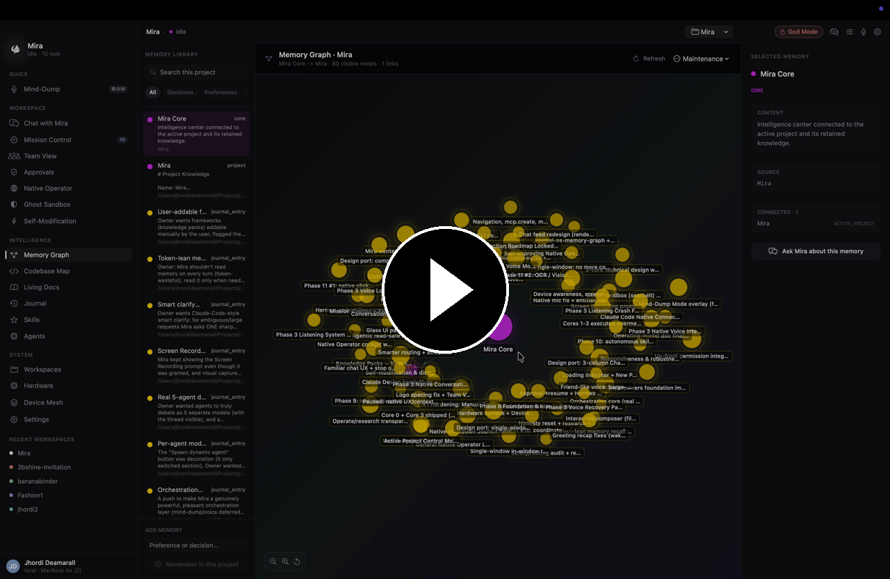
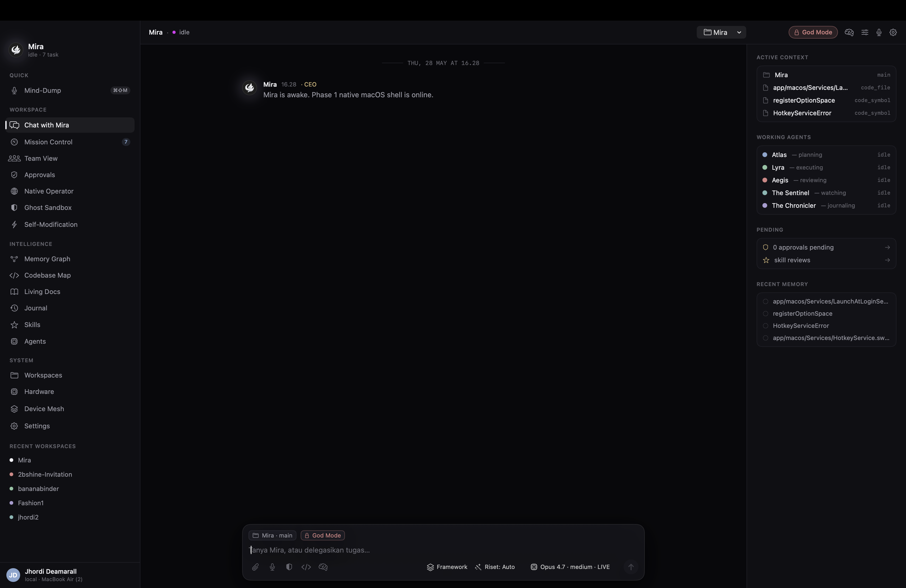
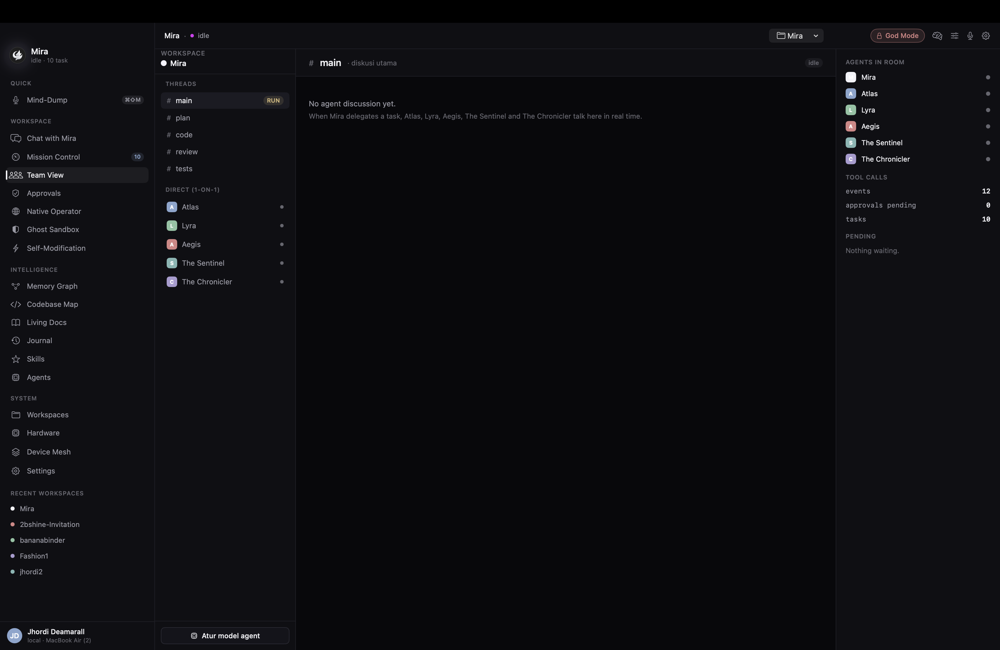
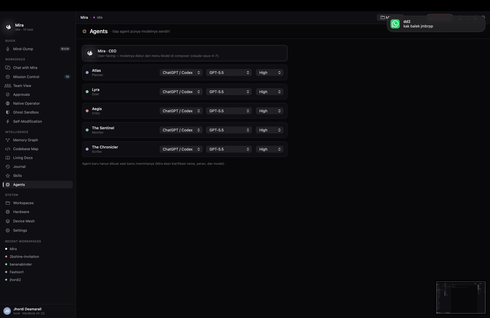
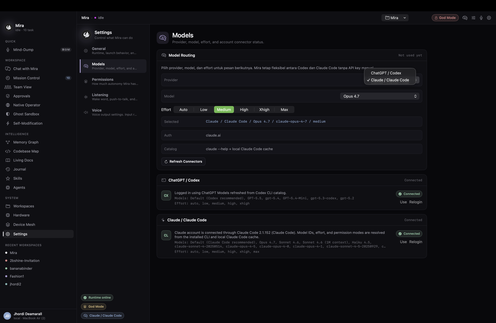
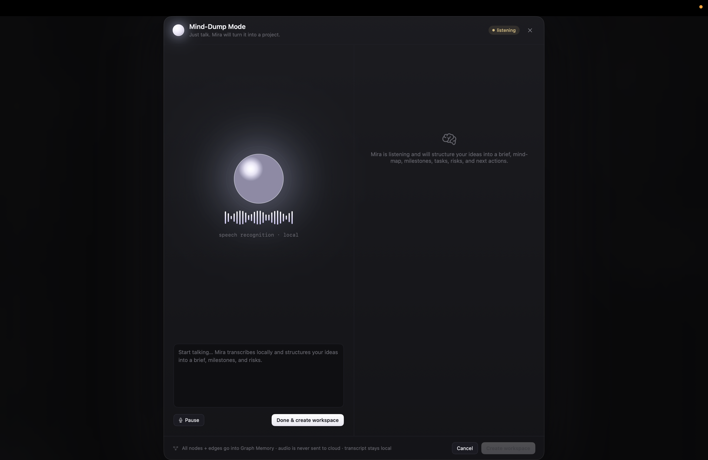

<div align="center">

# Mira

### A native macOS Operating System of Agents

**You talk to one Mira. She runs a team of AI agents, tools, and your whole Mac — locally, safely, and fast.**

[](https://www.apple.com/macos/)
[](https://support.apple.com/en-us/116943)
[](#privacy--safety)
[](LICENSE)

</div>

---

Mira isn't a chatbot. She's a **personal AI operating layer** for your Mac: a single, decisive interface that plans, delegates to a team of specialist agents, edits real files, ships to GitHub, drives native apps, and remembers your work — all on your machine, with every action you can review.

```bash
curl -fsSL https://github.com/jhordideamarall/mira-agent-v1/releases/latest/download/install.sh | bash
```

> This repository is the **public distribution channel** (installer + signed builds + release manifest). The source code is maintained privately.

---

## See it in action

<div align="center">

[](https://res.cloudinary.com/det0thpgd/video/upload/v1779962371/Memory_from_Mira_Agent_ts8ygj.mp4)

<sub><em>Mira's living memory graph — your work, connected, on-device. ▶ Click to play.</em></sub>

</div>

|  |  |
|---|---|
|  |  |
| **Chat with Mira** — one decisive interface. | **The agent team** — Atlas, Lyra, Aegis, Iris, Cipher & more. |
|  |  |
| **Per-agent models** — each agent on its own model + effort. | **Your own accounts** — Claude Code, Codex, DeepSeek. |
|  |  |
| **Mind-Dump** — speak freely; Mira structures it into memory. |  |

---

## Why Mira

- **🧠 An orchestration layer, not a single model.** One Mira (CEO, Claude Opus 4.7) delegates to a **dynamic, token-lean agent team**, each a real reasoning pass on its own model:
  - **Atlas** — planner (decision-complete plans, not vibes)
  - **Lyra** — doer (real file writes + commands)
  - **Aegis** — quality & security critic (a hard gate)
  - **Iris** — QA & Visual/UX director (Apple-grade design direction *before* code, then native browser QA after)
  - **Cipher** — security reviewer (secrets, authn/z, injection, OWASP)
  - **The Sentinel** (monitor) · **The Chronicler** (scribe) join complex work, plus an on-demand specialist (Data / Performance) spawned by need.
- **❓ It asks the right question first — like Claude Code.** Before spending tokens, Mira runs a smart **clarify gate**: 1–4 sharp questions with single-choice, multi-select, or free-text answers, each with a reason and a recommended default. No wrong-assumption rework.
- **🛠️ It actually does the work — safely.** Mira writes files and operates native macOS, with every side-effecting action gated by **Plan / Accept Edits / God Mode**, an approval flow, and a **hash-chained audit log**. Finished tasks hand you **one-click deliverables** — open the file, the project folder, or a live preview.
- **🔀 Native Git & GitHub.** Mira version-controls your work end-to-end — create a repo, branch, commit, push, open a Pull Request — straight from chat ("push this to GitHub"), slash commands, or a VS Code-like **Source Control** panel. Every workspace shows **which GitHub repo + account it's connected to**, and Mira is **collaboration-aware**: a solo repo pushes to `main`; a team repo (collaborators or a protected branch) routes through a feature branch + PR. Auth is your `gh` login — **Mira never stores a token** — and pushes/repo-creates pass the approval gate (force-push/hard-reset are never auto-approved).
- **🖥️ Operates your real Mac — natively, no cloud round-trip.** The Native Operator reads your screen (ScreenCaptureKit + on-device Vision OCR) and controls apps through Accessibility and Apple Events on *the Mac you're using* — not a remote browser or a cloud VM. Acting locally is faster and more direct than agents that pilot a sandbox in the cloud, and it stays under approval + audit the whole time.
- **🔑 Uses your own model accounts — no API keys.** Mira drives your installed **Claude Code** and **Codex** logins; their auth, config, and working directory carry over. Each agent's model + effort is configurable. **DeepSeek** joins as a first-class model.
- **🧩 Brings your setup with you.** Mira imports your existing **skills, agents, commands, and rules** from `~/.claude` and `~/.codex` — you stay in control. Per-language coding rules auto-load by project; skills and MCP servers are per-project. *Mira is the platform — no plugins to wrangle.*
- **🗺️ Local-first intelligence.** A memory graph that grows with you, a project codebase map, agentic research with cited sources, native voice, curated frameworks per project type, and a **journal that writes itself** after every work session.

---

## How a task flows

```
You ask Mira  →  Clarify (only if it matters)  →  Atlas plans
   →  Iris sets the visual/UX direction (for UI work)
   →  you approve  →  Lyra builds in small slices
   →  Aegis + Cipher review (quality + security gate)
   →  native verification (build / tests / browser QA)
   →  one-click deliverable  +  auto-journal & memory
```

Simple questions stay instant and cheap. Real work gets a real, reviewable pipeline — and you only sign off on the final result.

---

## Install

**Requirements**
- macOS 14 (Sonoma) or later · Apple Silicon
- [Claude Code](https://docs.anthropic.com/en/docs/claude-code) (`claude`) and [Codex](https://developers.openai.com/codex/cli/) (`codex`) installed and signed in — Mira uses your own logins, not API keys.
- *Optional:* [GitHub CLI](https://cli.github.com) (`gh`) signed in, to unlock native Git/GitHub.

**One-line install**

```bash
curl -fsSL https://github.com/jhordideamarall/mira-agent-v1/releases/latest/download/install.sh | bash
```

The installer downloads the latest build, **verifies its SHA-256 checksum**, installs Mira to `/Applications`, clears the Gatekeeper quarantine, and adds a `mira` command.

---

## Update

```bash
mira update        # update to the latest published build (no-op if already current)
```

Or without the shim:

```bash
curl -fsSL https://github.com/jhordideamarall/mira-agent-v1/releases/latest/download/install.sh | bash -s -- --update
```

Other commands:

```bash
mira            # open Mira
mira version    # show the installed version
```

---

## Privacy & safety

- **Local-first.** Memory, audit log, configuration, and skills live on your Mac.
- **You only talk to Mira.** Agents never act on you directly.
- **Every side-effect is gated** — risk classification → permission mode → approval → append-only, hash-chained audit log. Read-only research tools run agentically but stay traced.
- **Secrets stay in Keychain / your CLIs** — never in logs, prompts, memory, or imports. GitHub auth stays in `gh`; capability import never reads your tokens.

---

## Beta note

Beta builds are **self-signed** (not yet notarized by Apple), so the installer clears the Gatekeeper quarantine for you after verifying the checksum. Notarized distribution and richer auto-update are on the roadmap.

---

<div align="center">
<sub>Built for people who want their Mac to <em>do</em> things, not just chat about them.</sub>
</div>
